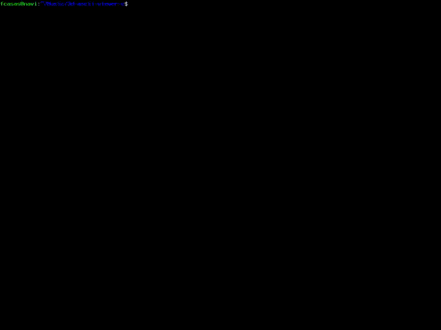

# 3d-ascii-viewer

Viewer of 3D models in ASCII, written in C.


Supported formats:

* [Wavefront .obj](https://en.wikipedia.org/wiki/Wavefront_.obj_file).
* [STL .stl](https://en.wikipedia.org/wiki/STL_(file_format)).

## Compile an run the program

You need developer's libraries for ncurses (the `libncurses-dev` package on Debian).

Compile the program using the `make` command:

```
$ make
```

You can try it passing any of the models in the `models` folder as an argument:

```
$ ./3d-ascii-viewer models/fox.obj
```

For additional options pass the `--help` option.

```
$ ./3d-ascii-viewer --help
```

## Color support

With the `--color` option, the program looks for the companion MTL files (referenced in the main OBJ file)
for information about the materials used by the model.

Characters within faces that use a material will be displayed with the **diffuse color** of said material.
Textures are not supported.



To use this option, the terminal must support color attributes and must be capable of redefining colors.
Also, the number of colors is limited by the maximum number of color pairs supported by ncurses.

## Models

* [Fox and ShibaInu models](https://opengameart.org/content/fox-and-shiba) made by PixelMannen for the Public Domain (CC0).
* [Tree models](https://opengameart.org/content/fox-trees-pack) made by Lokesh Mehra (mehrasaur) for the Public Domain (CC0).
* [Tux model](https://blendswap.com/blend/23774) made by Vido89 for the Public Domain (CC0).

ASCII luminescence idea by: [a1k0n.net](https://www.a1k0n.net/2011/07/20/donut-math.html)

**Note:** If you want to add a Public Domain (CC0) or MIT licenced model, you can send it as a Pull Request or open an Issue.
Remember to add the proper credits in the list here.

## Older version

There is also an [older version](https://github.com/autopawn/3d-ascii-viewer-haskell), written in Haskell.
